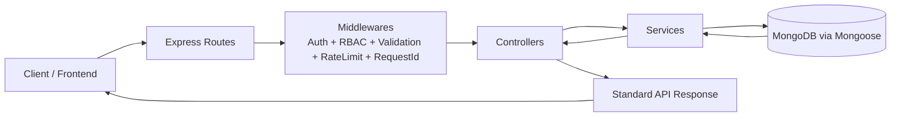
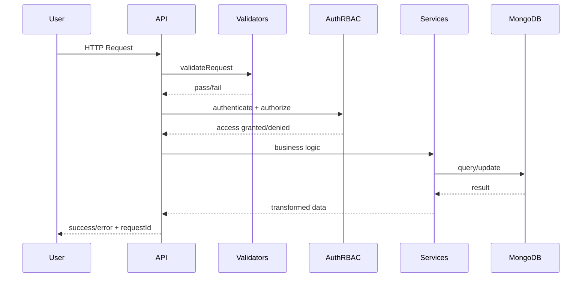
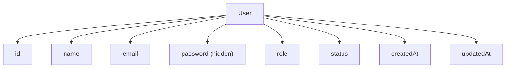
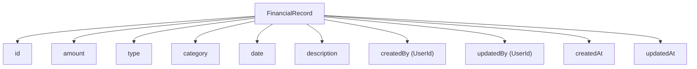
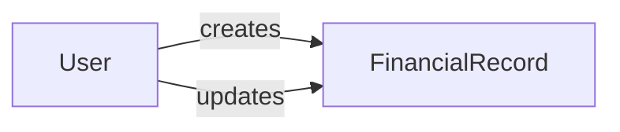

<div align="center">

<h1>Finance Data Processing and Access Control Backend</h1>


<p><strong>Production-style backend for secure financial data processing, RBAC, analytics, and tested API reliability.</strong></p>


<br/>

[](#contents)
[](#endpoint-map)
[](#quick-start)
[](#test-commands)

</div>

---

## Contents

- [Why This Project](#why-this-project)
- [Visual Architecture Map](#visual-architecture-map)
- [Request Lifecycle Graph](#request-lifecycle-graph)
- [Tech Stack](#tech-stack)
- [RBAC Matrix](#rbac-matrix)
- [Endpoint Map](#endpoint-map)
- [Endpoint Results](#endpoint-results)
- [Data Model Graph](#data-model-graph)
- [Quick Start](#quick-start)
- [Environment Setup](#environment-setup)
- [Response Contract](#response-contract)
- [Test Commands](#test-commands)
- [Seed + Demo Access](#seed--demo-access)
- [Project Structure](#project-structure)
- [Notes](#notes)

---

## Why This Project

This backend demonstrates practical engineering patterns for real-world systems:

- secure authentication and access control with role separation (`viewer`, `analyst`, `admin`)
- strict validation and consistent API response contracts
- service-layer business logic and clean route/controller boundaries
- aggregation-based dashboard analytics on financial records
- integration test coverage across all endpoint groups

### At A Glance

| Area | Focus | Implementation |
|---|---|---|
| Architecture | Layered backend design | Routes → Middlewares → Controllers → Services → Models |
| Security | Auth + access control | JWT auth, role-based authorization, rate limiting |
| Data | Finance record processing | Mongoose schemas, filters, aggregations, pagination |
| Quality | Endpoint reliability | Integration tests with Jest + Supertest |

---

## Visual Architecture Map



## Request Lifecycle Graph



---

## Tech Stack

| Layer          | Technology                             |
| -------------- | -------------------------------------- |
| Runtime        | Node.js                                |
| Web Framework  | Express.js                             |
| Database       | MongoDB                                |
| ODM            | Mongoose                               |
| Authentication | JWT + Cookie/Bearer support            |
| Security       | Helmet, CORS, express-rate-limit       |
| Validation     | express-validator                      |
| Logging        | Morgan                                 |
| Testing        | Jest, Supertest, mongodb-memory-server |

---

## RBAC Matrix

| Capability                       | Viewer | Analyst | Admin |
| -------------------------------- | :----: | :-----: | :---: |
| Login / Profile                  |   ✅   |   ✅   |  ✅  |
| List / View Records              |   ✅   |   ✅   |  ✅  |
| Dashboard Analytics              |   ✅   |   ✅   |  ✅  |
| Create / Update / Delete Records |   ❌   |   ❌   |  ✅  |
| User Management                  |   ❌   |   ❌   |  ✅  |

---

## Endpoint Map

```mermaid
flowchart TD
    API["/api/v1"]

    API --> AUTH["auth"]
    AUTH --> A1["POST /login"]
    AUTH --> A2["GET /me"]
    AUTH --> A3["POST /logout"]

    API --> USERS["users (Admin only)"]
    USERS --> U1["POST /"]
    USERS --> U2["GET /"]
    USERS --> U3["GET /:id"]
    USERS --> U4["PATCH /:id"]
    USERS --> U5["PATCH /:id/role"]
    USERS --> U6["PATCH /:id/status"]
    USERS --> U7["PATCH /:id/password-reset"]

    API --> RECORDS["records"]
    RECORDS --> R1["POST / (Admin)"]
    RECORDS --> R2["GET / (Authenticated)"]
    RECORDS --> R3["GET /:id (Authenticated)"]
    RECORDS --> R4["PATCH /:id (Admin)"]
    RECORDS --> R5["DELETE /:id (Admin)"]

    API --> DASH["dashboard (Authenticated)"]
    DASH --> D1["GET /summary"]
    DASH --> D2["GET /category-breakdown"]
    DASH --> D3["GET /trends"]
    DASH --> D4["GET /recent-activity"]
```



---

## Endpoint Results

### System

`GET /health`

```json
{
  "success": true,
  "message": "Server is healthy",
  "requestId": "a8eb7c2b-8275-49f8-b84f-6b0e2fdf1a7a"
}
```

`GET /api/v1`

```json
{
  "success": true,
  "message": "Finance API v1 is running"
}
```

### Auth

`POST /api/v1/auth/login`

```json
{
  "success": true,
  "message": "Login successful",
  "requestId": "67c64b1e-4f16-422d-bfda-f46e0fae9dd2",
  "data": {
    "token": "<jwt-token>",
    "user": {
      "_id": "67f09b8d727fce2e5e34ed43",
      "name": "Admin User",
      "email": "admin@finance.local",
      "role": "admin",
      "status": "active",
      "createdAt": "2025-01-01T10:20:30.000Z",
      "updatedAt": "2025-01-01T10:20:30.000Z"
    }
  }
}
```

`GET /api/v1/auth/me`

```json
{
  "success": true,
  "message": "Profile fetched successfully",
  "requestId": "b71d2d60-d232-45f1-a16f-4d2f6d7a3fd8",
  "data": {
    "_id": "67f09b8d727fce2e5e34ed43",
    "name": "Admin User",
    "email": "admin@finance.local",
    "role": "admin",
    "status": "active",
    "createdAt": "2025-01-01T10:20:30.000Z",
    "updatedAt": "2025-01-01T10:20:30.000Z"
  }
}
```

`POST /api/v1/auth/logout`

```json
{
  "success": true,
  "message": "Logout successful",
  "requestId": "2606b8f1-a252-4d96-8396-d4f8e8ed84b1",
  "data": null
}
```

### Users (Admin)

`POST /api/v1/users`

```json
{
  "success": true,
  "message": "User created successfully",
  "requestId": "90ecbe61-ce7f-40a8-8447-d9de7868fbb5",
  "data": {
    "_id": "67f09bf2727fce2e5e34ed55",
    "name": "New Viewer",
    "email": "newviewer@finance.local",
    "role": "viewer",
    "status": "active",
    "createdAt": "2025-01-03T09:00:00.000Z",
    "updatedAt": "2025-01-03T09:00:00.000Z"
  }
}
```

`GET /api/v1/users`

```json
{
  "success": true,
  "message": "Users fetched successfully",
  "requestId": "4a9fb4e8-cb02-45af-a5ad-26de4f9c8f90",
  "data": [
    {
      "_id": "67f09b8d727fce2e5e34ed43",
      "name": "Admin User",
      "email": "admin@finance.local",
      "role": "admin",
      "status": "active",
      "createdAt": "2025-01-01T10:20:30.000Z",
      "updatedAt": "2025-01-01T10:20:30.000Z"
    }
  ],
  "meta": {
    "page": 1,
    "limit": 10,
    "total": 4,
    "totalPages": 1
  }
}
```

`GET /api/v1/users/:id`

```json
{
  "success": true,
  "message": "User fetched successfully",
  "requestId": "25387f01-1f4b-4048-a6e4-fc7073723e93",
  "data": {
    "_id": "67f09bc3727fce2e5e34ed4a",
    "name": "Analyst User",
    "email": "analyst@finance.local",
    "role": "analyst",
    "status": "active",
    "createdAt": "2025-01-01T10:25:30.000Z",
    "updatedAt": "2025-01-01T10:25:30.000Z"
  }
}
```

`PATCH /api/v1/users/:id`

```json
{
  "success": true,
  "message": "User updated successfully",
  "requestId": "763ea107-c4da-4d9f-a138-f7bcb68bf63f",
  "data": {
    "_id": "67f09bf2727fce2e5e34ed55",
    "name": "Viewer Updated",
    "email": "newviewer@finance.local",
    "role": "viewer",
    "status": "active",
    "createdAt": "2025-01-03T09:00:00.000Z",
    "updatedAt": "2025-01-03T10:15:00.000Z"
  }
}
```

`PATCH /api/v1/users/:id/role`

```json
{
  "success": true,
  "message": "User role updated successfully",
  "requestId": "ca6d8b30-a2f7-4d6f-8e19-2c656149cc6a",
  "data": {
    "_id": "67f09bf2727fce2e5e34ed55",
    "name": "Viewer Updated",
    "email": "newviewer@finance.local",
    "role": "analyst",
    "status": "active",
    "createdAt": "2025-01-03T09:00:00.000Z",
    "updatedAt": "2025-01-03T10:25:00.000Z"
  }
}
```

`PATCH /api/v1/users/:id/status`

```json
{
  "success": true,
  "message": "User status updated successfully",
  "requestId": "d5cc48eb-7fa6-45c0-bd6b-6b10007072b8",
  "data": {
    "_id": "67f09bf2727fce2e5e34ed55",
    "name": "Viewer Updated",
    "email": "newviewer@finance.local",
    "role": "analyst",
    "status": "inactive",
    "createdAt": "2025-01-03T09:00:00.000Z",
    "updatedAt": "2025-01-03T10:35:00.000Z"
  }
}
```

`PATCH /api/v1/users/:id/password-reset`

```json
{
  "success": true,
  "message": "User password reset successfully",
  "requestId": "32598f1c-8e31-47fc-b3f3-127b1a89a5d6",
  "data": {
    "id": "67f09bf2727fce2e5e34ed55"
  }
}
```

### Records

`POST /api/v1/records` (Admin)

```json
{
  "success": true,
  "message": "Record created successfully",
  "requestId": "749da2f0-f5ea-408f-a3af-bc6acc2929a5",
  "data": {
    "_id": "67f09d66727fce2e5e34edf9",
    "amount": 5000,
    "type": "income",
    "category": "Freelance",
    "date": "2025-01-11T00:00:00.000Z",
    "description": "API project payment",
    "createdBy": "67f09b8d727fce2e5e34ed43",
    "updatedBy": "67f09b8d727fce2e5e34ed43",
    "createdAt": "2025-01-11T09:00:00.000Z",
    "updatedAt": "2025-01-11T09:00:00.000Z"
  }
}
```

`GET /api/v1/records`

```json
{
  "success": true,
  "message": "Records fetched successfully",
  "requestId": "33b6140e-c107-4f87-8aa3-ec352114f9db",
  "data": [
    {
      "_id": "67f09d66727fce2e5e34edf9",
      "amount": 5000,
      "type": "income",
      "category": "Freelance",
      "date": "2025-01-11T00:00:00.000Z",
      "description": "API project payment",
      "createdBy": {
        "_id": "67f09b8d727fce2e5e34ed43",
        "name": "Admin User",
        "email": "admin@finance.local",
        "role": "admin"
      },
      "updatedBy": {
        "_id": "67f09b8d727fce2e5e34ed43",
        "name": "Admin User",
        "email": "admin@finance.local",
        "role": "admin"
      },
      "createdAt": "2025-01-11T09:00:00.000Z",
      "updatedAt": "2025-01-11T09:00:00.000Z"
    }
  ],
  "meta": {
    "page": 1,
    "limit": 10,
    "total": 1,
    "totalPages": 1
  }
}
```

`GET /api/v1/records/:id`

```json
{
  "success": true,
  "message": "Record fetched successfully",
  "requestId": "f4f31e06-52be-4af4-a8b7-c54af8aa4dc5",
  "data": {
    "_id": "67f09d66727fce2e5e34edf9",
    "amount": 5000,
    "type": "income",
    "category": "Freelance",
    "date": "2025-01-11T00:00:00.000Z",
    "description": "API project payment",
    "createdBy": {
      "_id": "67f09b8d727fce2e5e34ed43",
      "name": "Admin User",
      "email": "admin@finance.local",
      "role": "admin"
    },
    "updatedBy": {
      "_id": "67f09b8d727fce2e5e34ed43",
      "name": "Admin User",
      "email": "admin@finance.local",
      "role": "admin"
    },
    "createdAt": "2025-01-11T09:00:00.000Z",
    "updatedAt": "2025-01-11T09:00:00.000Z"
  }
}
```

`PATCH /api/v1/records/:id` (Admin)

```json
{
  "success": true,
  "message": "Record updated successfully",
  "requestId": "7ddf73d5-bf1c-4f5b-92f4-7494de1790ac",
  "data": {
    "_id": "67f09d66727fce2e5e34edf9",
    "amount": 5500,
    "type": "income",
    "category": "Freelance",
    "date": "2025-01-11T00:00:00.000Z",
    "description": "Updated API payment",
    "createdBy": {
      "_id": "67f09b8d727fce2e5e34ed43",
      "name": "Admin User",
      "email": "admin@finance.local",
      "role": "admin"
    },
    "updatedBy": {
      "_id": "67f09b8d727fce2e5e34ed43",
      "name": "Admin User",
      "email": "admin@finance.local",
      "role": "admin"
    },
    "createdAt": "2025-01-11T09:00:00.000Z",
    "updatedAt": "2025-01-11T10:00:00.000Z"
  }
}
```

`DELETE /api/v1/records/:id` (Admin)

```json
{
  "success": true,
  "message": "Record deleted successfully",
  "requestId": "89d4b73d-4026-41ad-ae9e-1e87e0c60235",
  "data": {
    "id": "67f09d66727fce2e5e34edf9"
  }
}
```

### Dashboard

`GET /api/v1/dashboard/summary`

```json
{
  "success": true,
  "message": "Dashboard summary fetched successfully",
  "requestId": "a70adbd5-d267-4f48-9212-6de53b8f1e62",
  "data": {
    "totalIncome": 215000,
    "totalExpenses": 60450,
    "netBalance": 154550
  }
}
```

`GET /api/v1/dashboard/category-breakdown`

```json
{
  "success": true,
  "message": "Category breakdown fetched successfully",
  "requestId": "6f60917f-3ea7-4cfd-afde-7a3f8bd3ee1b",
  "data": [
    {
      "category": "Salary",
      "type": "income",
      "total": 258500,
      "count": 3
    },
    {
      "category": "Rent",
      "type": "expense",
      "total": 18600,
      "count": 3
    }
  ]
}
```

`GET /api/v1/dashboard/trends`

```json
{
  "success": true,
  "message": "Trends fetched successfully",
  "requestId": "7e6ac870-84e1-4cb8-9131-a6f4119aeb8d",
  "data": [
    {
      "year": 2025,
      "month": 1,
      "type": "expense",
      "total": 18000,
      "count": 7
    },
    {
      "year": 2025,
      "month": 1,
      "type": "income",
      "total": 101000,
      "count": 3
    }
  ]
}
```

`GET /api/v1/dashboard/recent-activity`

```json
{
  "success": true,
  "message": "Recent activity fetched successfully",
  "requestId": "62893890-df52-4a8f-86e8-cda8c8f1c6f8",
  "data": [
    {
      "_id": "67f09d66727fce2e5e34edf9",
      "amount": 5000,
      "type": "income",
      "category": "Freelance",
      "date": "2025-01-11T00:00:00.000Z",
      "description": "API project payment",
      "createdBy": {
        "_id": "67f09b8d727fce2e5e34ed43",
        "name": "Admin User",
        "email": "admin@finance.local",
        "role": "admin"
      },
      "updatedBy": {
        "_id": "67f09b8d727fce2e5e34ed43",
        "name": "Admin User",
        "email": "admin@finance.local",
        "role": "admin"
      },
      "createdAt": "2025-01-11T09:00:00.000Z",
      "updatedAt": "2025-01-11T09:00:00.000Z"
    }
  ]
}
```

---

## Data Model Graph







---

## Quick Start

### Clone Instructions

HTTPS:

```bash
git clone https://github.com/Arbab-ofc/Finance-Data-Processing-and-Access-Control-Backend.git
cd Finance-Data-Processing-and-Access-Control-Backend
```

SSH:

```bash
git clone git@github.com:Arbab-ofc/Finance-Data-Processing-and-Access-Control-Backend.git
cd Finance-Data-Processing-and-Access-Control-Backend
```

### Run Locally

```bash
cd backend
npm install
cp .env.example .env
npm run seed
npm run dev
```

Server base URL: `http://localhost:5000`
API base path: `/api/v1`

---

## Environment Setup

Create `backend/.env`:

```env
PORT=5000
NODE_ENV=development
MONGODB_URI=mongodb://127.0.0.1:27017/finance_backend
JWT_SECRET=replace-with-strong-secret
JWT_EXPIRES_IN=1d
CLIENT_URL=http://localhost:3000
AUTH_COOKIE_NAME=token
MONGO_SERVER_SELECTION_TIMEOUT_MS=10000
MONGO_MAX_POOL_SIZE=10
```

Use a strong `JWT_SECRET` for any shared/deployed environment.

---

## Response Contract

### Success

```json
{
  "success": true,
  "message": "Records fetched successfully",
  "data": [],
  "requestId": "2f4a5d68-faf0-44f4-a5eb-5ec6f8ebd8fc",
  "meta": {
    "page": 1,
    "limit": 10,
    "total": 0,
    "totalPages": 1
  }
}
```

### Error

```json
{
  "success": false,
  "message": "Validation failed",
  "requestId": "2f4a5d68-faf0-44f4-a5eb-5ec6f8ebd8fc",
  "errors": [
    { "field": "email", "message": "Invalid email" }
  ]
}
```

---

## Test Commands

```bash
cd backend
npm test
```

CI-friendly:

```bash
npm run test:ci
```

---

## Seed + Demo Access

Seed command:

```bash
cd backend
npm run seed
```

Demo users:

- Admin: `admin@finance.local` / `Admin@123`
- Analyst: `analyst@finance.local` / `Analyst@123`
- Viewer: `viewer@finance.local` / `Viewer@123`

---

## Project Structure

```text
.
  README.md
backend/
  .env.example
  API_REFERENCE.md
  TESTING.md
  package.json
  src/
    app.js
    server.js
    config/
    constants/
    controllers/
    middlewares/
    models/
    routes/
    seeds/
    services/
    tests/
    utils/
    validations/
```

---

## Notes

- Inactive users cannot authenticate.
- Auth is accepted via `Authorization: Bearer <token>` or auth cookie.
- Update endpoints enforce non-empty patch payloads.
- Standardized responses include `requestId` for traceability.
